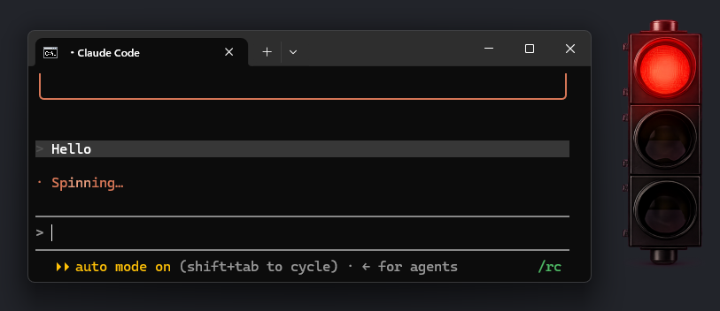
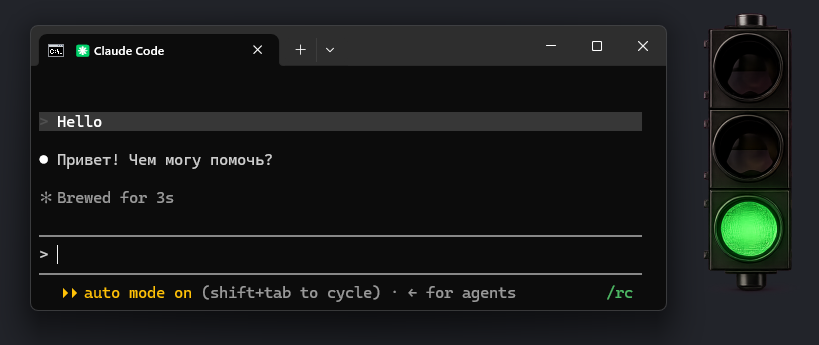
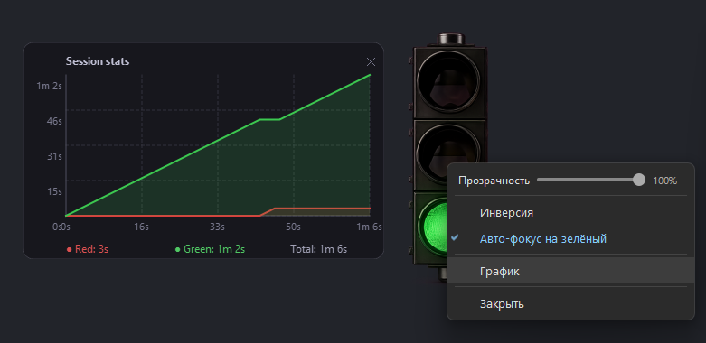

# TrafficLight

Visual status indicator for [Claude Code](https://claude.ai/code). A small always-on-top window showing a traffic light that reflects what Claude is doing.

## What it does

| Color | Meaning |
|-------|---------|
| 🔴 Red | Claude is working (received a prompt or using a tool) |
| 🟡 Yellow | Transitioning to green |
| 🟢 Green | Done / waiting for input |

| Working | Idle |
|---------|------|
|  |  |

Hover the light to see a live preview of the Claude terminal window; click it to bring that terminal to front.

Right-click the window for settings: opacity slider, red↔green inversion toggle, auto-focus (switches to the Claude terminal on green), session stats chart.



## Requirements

- Python 3.13+
- [uv](https://docs.astral.sh/uv/)

## Install

Easiest — ask Claude Code to do it:

```powershell
claude -p "install https://github.com/Yarodash/TrafficLight"
```

Or run the installer directly:

```powershell
python install.py https://github.com/Yarodash/TrafficLight D:/TrafficLight
```

Or manually:

```powershell
git clone https://github.com/Yarodash/TrafficLight D:/TrafficLight
cd D:/TrafficLight
uv sync
```

## Claude Code integration

Add hooks to `~/.claude/settings.json` — see [`CLAUDE_README.md`](CLAUDE_README.md) for the full config.

With hooks in place the light starts automatically on session open, turns red on every prompt/tool call, and green when Claude stops.
