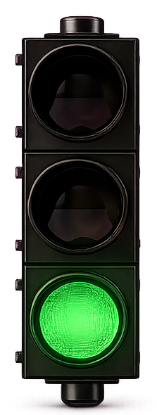

# TrafficLight

Visual status indicator for [Claude Code](https://claude.ai/code). A small always-on-top window showing a traffic light that reflects what Claude is doing.



## What it does

| Color | Meaning |
|-------|---------|
| 🔴 Red | Claude is working (received a prompt or using a tool) |
| 🟡 Yellow | Transitioning to green |
| 🟢 Green | Done / waiting for input |

Right-click the window for settings: opacity slider, red↔green inversion toggle, auto-focus (switches to the Claude terminal on green).

## Requirements

- Python 3.13+
- [uv](https://docs.astral.sh/uv/)

## Install

```powershell
git clone <repo>
cd TrafficLight
uv sync
```

## Usage

```powershell
# create a window, get its ID
$id = python cli.py --create

# change color
python cli.py --manage $id --set-color red
python cli.py --manage $id --set-color yellow
python cli.py --manage $id --set-color green

# close
python cli.py --manage $id --exit
```

## Claude Code integration

Add to `~/.claude/settings.json` to make it fully automatic — see [`CLAUDE_README.md`](CLAUDE_README.md) for the hook config.

With hooks in place the light starts automatically on session open, turns red on every prompt/tool call, and green when Claude stops.

## Sprites

`green.png`, `yellow.png`, `red.png` — cropped from a source image using `make_lights.py`:

```powershell
python make_lights.py --origin_x 88 --origin_y 216 --size_x 223 --size_y 590 --gap_x 86
```
